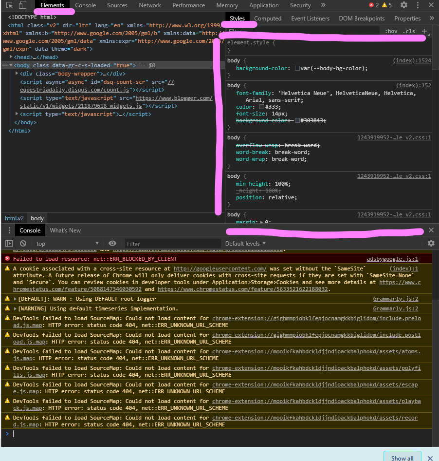

# HTML CSS Model #
This model contains several Sub-modules that are under this directory, this file is like a table of Contents. 

## HTML CSS ##


* Objective: 
    * Know that HTLM stands for. 
    * Know basic elements of HTML. 
    * Know what is CSS and what to learn about CSS. 
* Resources: 
    * [Link]( 
    https://developer.mozilla.org/en-US/docs/Learn/HTML/Introduction_to_HTML/Getting_started) What is HTML. 
    * [Link](https://developer.mozilla.org/en-US/docs/Learn/CSS/Styling_text/Fundamentals) What is CSS 

* Stuff Contained: 
  * This Document Itself. 
  * CSS Selector, DOM Model
    * DOM Model for the web page. 
    * How to select elements(tags) in HTML via CSS. 

## Key terms ## 
* HTML: Hypertext Markup Lauguage
* CSS: Styling Web pages. 
* JavaScript: Adding programmable interactivities to web pages. 
* AJAX: Thing used for fetching data for websites. 
* JASON: A protolcol of encoding information, which can be read and parsed by javascript. (Like Serializable in Java)
* REST APIS: Webserver's end points that handle client's requests. 
* SQL: The server that store data, or just the "Database"
* DOM: Document Objects Model

## HTML Elements ##
```
<p>This is a paragraph<\p>
```
Displayed as a paragraph in htmp file. 
HTML element has the following syntax: 
```
<element attribute="value" attribute="value"> content </element>
```
Notice that `attribute` in the opening tag and its value following by `=` in quotation. 

However here is how a complete HTML file should always be written: 
```
<!DOCTYPE html>
<html>
  <head>
    information about the page
  </head>
  <body>
    page contents
  </body>
</html>
```
It consists of at least these 3 elements in order to make it valid. 

Commenting on HTML File: 
```
<!-- My webpage -->
```
This tag will be ignored by the broswer, it's meant for annotating HTML content. 

### Tips ###
* Use ctrl + shift + i to access the developer panel to view the HTML sorce os a website. 

* Do that for the following website: 
    https://courses.cs.washington.edu/courses/cse154/19su/lectures/lec02-html-css/code/koala-page-lec02/koala.html
* Observe the list of common html tags, and hover your mouse over the in the developer panel to learn how they look like on the page.  

## CSS ##
CSS stands for cascading stylesheet, which is used along HTML and it define the style of the text on the website. 

* In order to use the style sheet, you need to include it into the HTML web page by defining it in the `head` tag using the `link` tag. 

```
<html>
  <head>
    <meta charset="utf--8">
    <link href="thecss.css", rel="stylesheet">
    <title>title</title>
  <head>
  <body>
  
  </body>
</html>

```

Observe the `<link href="thecss.css", rel="stylesheet">`, this is the part where it adds the style shit into the HTML page. 

Read more in the resources section above on the top. Here we will look at some minimalistic examples: 

```
p {
  font-weight: bold;
  colour: blue; /* incorrect spelling of the color property */
  font-size: 200%;
}
```

One of the this particular element in the CSS is called the **rules**, and the lines inside of it is called **property**. They actually define the style. 

The letter `p` at the start of the curly braces denotes the target of the styling, in this case it's the `<p>` tag in the html, which is all the paragraphs in the HTML. That single letter in this case is called a "CSS Selector" 

## What is hard about CSS ## 

This question needs to be addressed before proceeding further into learning about it, CSS is complicated and it's not beautifully design, compare to like, JAVA, and C++, but the good thing is, it has rules and it's deterministic, however it's hard to understand. Here are a list of aspects that make it complicated. 

1. How to select an element via CSS selector? 
    * How does all the CSS selector works and how to use them creatively to achieve something needs understandings in all major aspects of the things. 
2. How does inheritance works in the CSS?
3. How does rules override and changes when there are many of them?
4. How does each rule style the web page?

These questions will be addressed throughout the whole learning process of frontend web programming. 

## How to Observe CSS of other websites in Browser? ##

ctrl + shift + I to open up the Developer Panel, then: 

* 

Conveniently, the developer tools tell you a lot of information about the CSS rules and properties, you can also make changes to them and observe them changes in real time on the website. This is making the learning process very fun. 

Try and do that for the following websites: 

* [CSE 154 Koala Example with CSS](https://courses.cs.washington.edu/courses/cse154/19su/lectures/lec03-intro-css/code/koala-page-complete/koala.html)